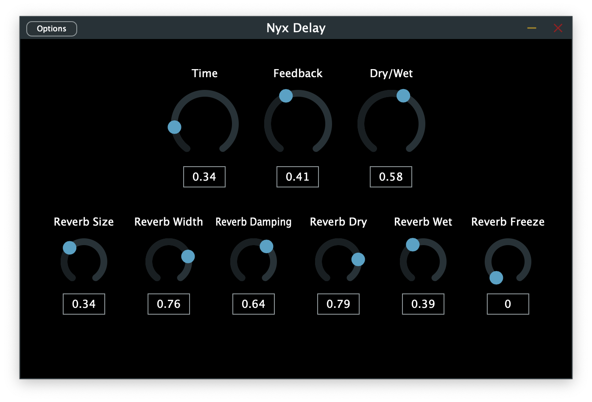

# EP-491-Delay

## Project Description 

Delay audio effect plugin in VST3 and AU format, written in C++ and the JUCE framework. 

Project for Advanced Projects in Electronic Production and Design (EP-491) at Berklee College of Music.

## Demo

[SoundCloud Link](https://soundcloud.com/user-67320085-103319864/nyx/s-W4GLmHxoer8?si=f1aecf1660e34d909b5a3bfcb92fafb6&utm_source=clipboard&utm_medium=text&utm_campaign=social_sharing)

## Building

Download the [JUCE framework](https://juce.com/get-juce/) before
cloning this repo. Open "EP-491-Delay.jucer" and open the source files in your preferred exporter. 

In your IDE, select the plugin format you wish to use, and run the program. The plugin will then be available in the plugins section of your DAW.
